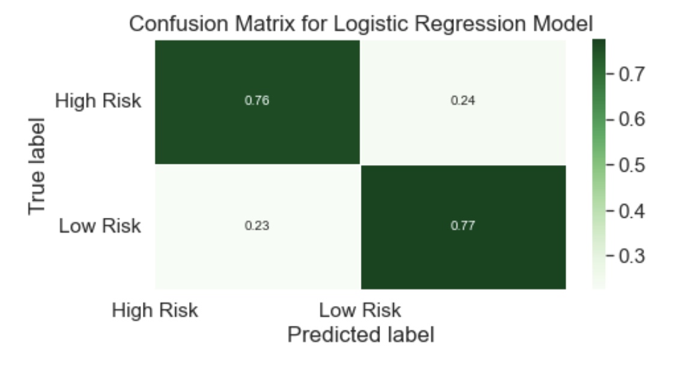

# Credit_Risk_Evaluation_Supervised_Learning
Supervised Machine Learning to predict Credit Risk.  Review of Logistic Regression and Random Forest Classifier with and without scaling.

## Background

'LendingClub' is a peer-to-peer lending services company that allows individual investors to partially fund personal loans as well as buy and sell notes backing the loans on a secondary market. LendingClub offers their previous data through an API.

Used this data to create machine learning models to classify the risk level of given loans. Specifically, compared the Logistic Regression model and Random Forest Classifier.

### Retrieved the data

In the `Generator` folder in `Resources`, there is a [GenerateData.ipynb](/Resources/Generator/GenerateData.ipynb) notebook downloaded data from LendingClub and output two CSVs: 

* `2019loans.csv`
* `2020Q1loans.csv`

Used an entire year's worth of data (2019) to predict the credit risk of loans from the first quarter of the next year (2020).

Note: these two CSVs have been undersampled to give an even number of high risk and low risk loans. In the original dataset, only 2.2% of loans are categorized as high risk. To get a truly accurate model, special techniques need to be used on imbalanced data. Undersampling is one of those techniques. Oversampling and SMOTE (Synthetic Minority Over-sampling Technique) are other techniques that are also used.

## Preprocessing: Converted categorical data to numeric

Created a training set from the 2019 loans using `pd.get_dummies()` to convert the categorical data to numeric columns. Similarly, created a testing set from the 2020 loans, also using `pd.get_dummies()`. Note! There are categories in the 2019 loans that do not exist in the testing set. If fitted a model to the training set and tried to score it on the testing set as is, one will get an error. Needed to use code to fill in the missing categories in the testing set. 

## Considered the models

Created and compared two models on this data: a logistic regression, and a random forests classifier. Before creating, fitting, and scoring the models, made a prediction as to which model may perform better. One does not need to be correct! Wrote down (in markdown cells in your Jupyter Notebook) the prediction, and provided justification for the educated guess.

## Fitted a LogisticRegression model and RandomForestClassifier model

Created a LogisticRegression model, fitted it to the data, and printed the model's score. Did the same for a RandomForestClassifier. Chose starting hyperparameters. Reviewed which model performed better. Compared results to those predicted. Wrote down the results and thoughts.

## Revisited the Preprocessing: Scale the data

The data going into these models was never scaled, an important step in preprocessing. Used `StandardScaler` to scale the training and testing sets. Before re-fitting the LogisticRegression and RandomForestClassifier models on the scaled data, made another prediction about how one may think scaling will affect the accuracy of the models. Wrote the predictions down and provided justification.

Fitted and scored the LogisticRegression and RandomForestClassifier models on the scaled data. Checked how the model scores compared to each other, and to the previous results on unscaled data. Checked how this compared to the prediction. Wrote down the results and thoughts.

## Scaled Results

### References

LendingClub (2019-2020) _Loan Stats_. Retrieved from: [https://resources.lendingclub.com/](https://resources.lendingclub.com/)

- - -

© 2021 SherryKennedy. All Rights Reserved.
